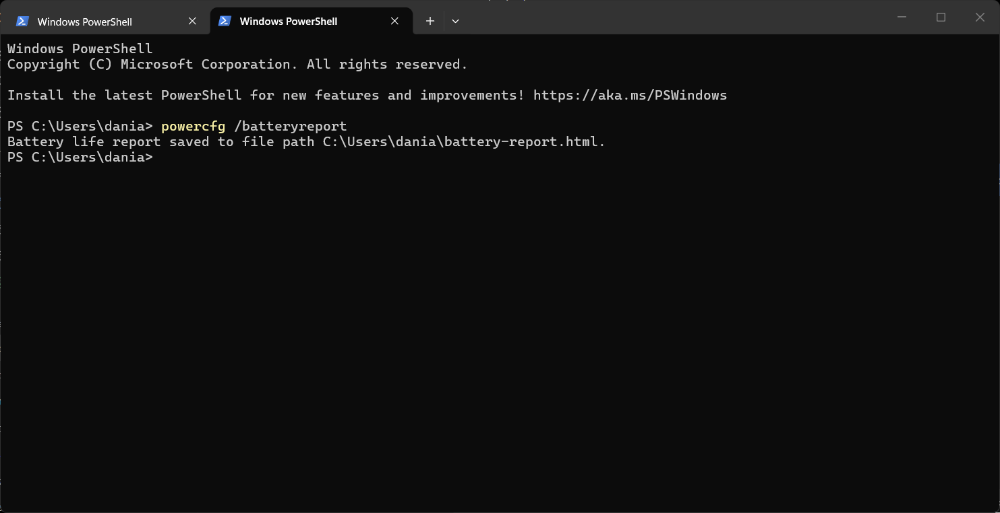
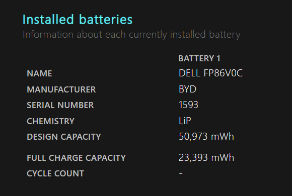
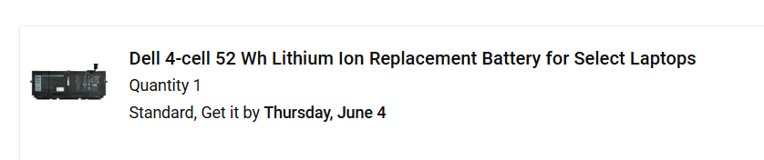

# Dell XPS 13 9310 – Battery Diagnosis & Replacement

## Overview

This project documents the diagnosis and planned replacement of a degraded battery in a Dell XPS 13 9310.

After experiencing rapid battery drain and unexpected shutdowns at low battery percentages, I used Windows PowerShell to generate a battery report and assess the battery’s condition. The report showed that the battery’s full charge capacity had reduced significantly compared to its original design capacity.

After confirming the issue was likely battery-related, I sourced the correct replacement battery directly from Dell to ensure compatibility and reduce the risk of using an incorrect or unreliable third-party part.

The replacement battery has been ordered, and the installation/testing stage will be documented once completed.

---

# Objective

The goal of this project was to:

- Diagnose the cause of battery and charging issues
- Determine whether the issue was battery-related or charger-related
- Research and source the correct replacement battery
- Prepare for battery replacement and validation testing

---

# Device Information

- Device: Dell XPS 13 9310
- Operating System: Windows 11
- Tools/Utilities Used:
  - Windows PowerShell
  - Windows Battery Report
  - Dell BIOS Battery Diagnostics

---

# Problem

## Symptoms

The laptop began experiencing several battery-related issues during normal use:

- Rapid battery drain
- Unexpected shutdowns around 10% battery
- Reduced battery life
- Inconsistent charging behaviour

---

# Troubleshooting & Investigation

## Windows Battery Report

To investigate the issue further, a Windows battery report was generated using PowerShell:

```powershell
powercfg /batteryreport
```

The report was successfully generated and saved locally for analysis.

### PowerShell Output



---

## Battery Health Findings

The generated battery report showed:

- Design Capacity: 50,973 mWh
- Full Charge Capacity: 23,393 mWh

This indicated the battery had degraded significantly and retained approximately 46% of its original capacity.

### Battery Report



---

# Findings

Based on the investigation:

- The battery showed significant wear and degradation
- The issue appeared to be battery-related rather than charger-related
- Battery replacement was determined to be the most appropriate solution

---

# Research & Planning

## Research Completed

Before replacing the battery:

Before replacing the battery:

- Identified the exact Dell XPS 13 9310 battery model
- Researched compatible replacement batteries
- Chose to source the replacement battery directly from Dell
- Reviewed Dell repair documentation and replacement procedures

---

## Replacement Battery Research

After confirming significant battery degradation, a compatible replacement battery was sourced directly from Dell to ensure compatibility and reliability.



---

# Current Status

- Replacement battery ordered directly from Dell
- Installation and testing phase pending

This documentation will be updated once the battery replacement has been completed and post-repair testing has been carried out.

---

# Skills Demonstrated

- Hardware troubleshooting
- Diagnostics
- PowerShell usage
- Technical research
- Problem-solving
- Documentation

---

# Reflection

This project improved my understanding of battery diagnostics and reinforced the importance of validating the root cause of an issue before replacing hardware components.
